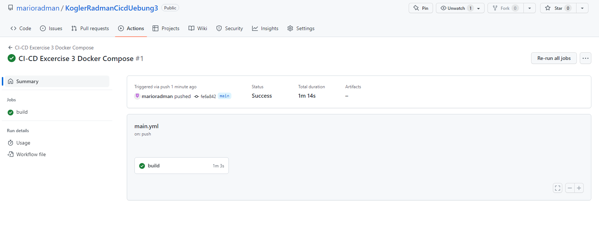

# CI-CD Übungsaufgabe 03

Multi Container Application mit Docker Compose

[Originale Project-Readme, mit wichtigen Informationen zum Setup und Co.
](docs/originalProjectReadme.md)

## About
- Continuous Delivery
- WS 22/23
- MSD20
- FH Joanneum

## Gruppe
- Tobias Kogler
- Mario Radman

## Übungsteil 1 - Docker Compose

Anleitung wie vorgegeben hier wurde durchgeführt:
[https://docs.docker.com/compose/gettingstarted/](https://docs.docker.com/compose/gettingstarted/)

Schritte:
- Setup des Programms
- Setup des Dockerfiles und der docker-compose.yaml
- Starten von docker compose

`docker compose up`

Interessant ist es, wenn man Dateien ändert während docker läuft (z.B. das Python programm) muss
Docker nicht neu gestartet werden. Es kümmert sich automatisch darum.

## Übungsteil 2 - Repository Clonen & Kennenlernen

Repo wurde gecloned und mit `docker compose up` gestartet.
Es macht ein paar Probleme, weshalb alte images vorab gelöscht werden mussten.

FEHLERBEHEBUNG:
Möglich durch Änderung der ports in den dockerfiles/node-files. Die Ports haben sich nämlich überlappt.

# Übungsteil 3 - Github Workflow Erweitern

[Zusätzlicher Workflow wurde erstellt](.github/workflows/ciExc3.yml), entsprechend der Angabe.

# Übungsteil 4 - Gegenseitiges Testen

Wurde durchgeführt auf mehreren Maschinen:
- 2x Windows
- 1x Mac

Auf den Windows PCs gab es jedes Mal das Problem, dass docker-compose nicht sofort funktioniert hat.
Stattdessen mussten zuerst images und container gelöscht werden.

Am Mac hat es (aus unbekannten Gründen, eventuell weil Docker komplett sauber neu installiert war) keine Probeleme gegeben.
